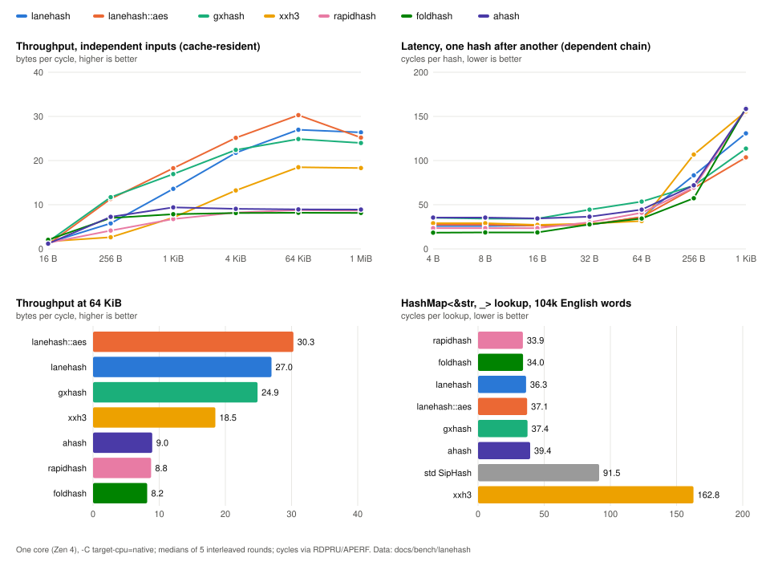

# lanehash

**Fast, portable, non-cryptographic 64-bit and 128-bit hashing for Rust.**

`lanehash` provides two independent hash functions behind one API:

* **`lanehash`** is the default algorithm. It has no instruction-set requirement and produces identical output across the scalar reference, SSE2, AVX2, AVX-512, NEON, and wasm SIMD128 backends.
* **`lanehash::aes`** is the AES-based variant. It is optimized for bulk workloads on CPUs with VAES.

Both algorithms provide 64-bit and 128-bit hashing, streaming APIs, and `HashMap` / `HashSet` support.

## Highlights

* **Fast:** up to 27 bytes/cycle at 64 KiB on Zen 4; the AES variant reaches up to 30 bytes/cycle with VAES.
* **Competitive on short keys:** 1 to 31 byte inputs are approximately 17 cycles/hash in the rurban harness.
* **Portable:** scalar fallback plus SSE2, AVX2, AVX-512, NEON, and wasm SIMD128 backends.
* **Deterministic:** every backend produces identical output for the same input and seed.
* **Runtime dispatch:** selects the fastest supported backend on x86-64 and aarch64.
* **Streaming:** `Stream` is available for both algorithms.
* **Batched hashing:** available for the AES variant.
* **`HashMap` / `HashSet`:** `RandomState` and `FixedState` for both algorithms.
* **`no_std`:** no runtime dependencies.
* **Memory-safe:** no out-of-bounds reads; Miri-clean and guard-page tested.
* **Cross-language:** C and WebAssembly implementations are included.

## Which algorithm?

|                      | `lanehash`                  | `lanehash::aes`                                     |
| -------------------- | --------------------------- | --------------------------------------------------- |
| Hardware requirement | None                        | AES-NI / VAES / Armv8 AES for hardware acceleration |
| 64 KiB on Zen 4      | 27 B/cycle                  | 28 to 30 B/cycle                                    |
| 1 to 31 B keys       | 17.2 cycles/hash            | 18.6 cycles/hash                                    |
| HashMap workload     | 97.7 cycles/op              | 97.3 cycles/op                                      |
| wasm32               | SIMD128 backend             | Software AES                                        |
| SMHasher names       | `lanehash64`, `lanehash128` | `lanehash_aes64`, `lanehash_aes128`                 |

The two algorithms produce unrelated outputs.

## Installation

```toml
[dependencies]
lanehash = "0.2"
```

## Usage

### One-shot

```rust
let h64 = lanehash::hash64(b"hello world", 42);
let h128 = lanehash::hash128(b"hello world", 42);
```

### Streaming

`Stream` produces the same result as one-shot hashing:

```rust
let mut stream = lanehash::Stream::new(42);

stream.update(b"hello ");
stream.update(b"world");

assert_eq!(
    stream.finish128(),
    lanehash::hash128(b"hello world", 42)
);
```

### `HashMap` / `HashSet`

```rust
use std::collections::HashMap;

let mut map: HashMap<&str, u32, lanehash::RandomState> =
    HashMap::default();

map.insert("key", 1);
```

For deterministic hashing:

```rust
let fixed: HashMap<u64, u64, lanehash::FixedState> =
    HashMap::with_hasher(lanehash::FixedState::new(7));
```

`RandomState` and `FixedState` use a separate `std::hash::Hasher` implementation. Its output is an implementation detail and may change between minor releases. Do not persist it or use it as a stable serialization format.

### AES variant

The AES implementation exposes the same core API under `lanehash::aes`, plus batched hashing:

```rust
let h = lanehash::aes::hash64(b"hello world", 42);

let mut stream = lanehash::aes::Stream::new(42);
stream.update(b"hello world");

assert_eq!(stream.finish64(), h);
```

Batched hashing:

```rust
let records: Vec<&[u8]> = vec![
    &[1u8; 200],
    &[2u8; 300],
    b"short",
];

let mut output = vec![0u64; records.len()];

lanehash::aes::hash64_batch(
    &records,
    42,
    &mut output,
);
```
# Performance

Benchmark results are hardware and configuration dependent. The numbers below are provided to document representative workloads rather than as universal performance rankings.



Raw benchmark data is available in [`docs/bench/lanehash/`](docs/bench/lanehash/): the
chart's `throughput.csv`, `latency.csv` and `workloads.csv`, and the `*-final*` files
behind the table below, whose rows are still named `lh2`, the function name before 0.2.
`bench/chart.py` renders the chart from the CSVs.

## Default algorithm

Measured on an AMD Ryzen 5 7600 (Zen 4), using the same binary and buffers for all implementations. The default `cargo build --release` configuration was used, with runtime dispatch selecting AVX-512.

| Input                  |     lanehash | xxh3 (AVX-512) | rapidhash v3 |
| ---------------------- | -----------: | -------------: | -----------: |
| 4 to 16 B, cycles/hash | 11.4 to 12.0 |    9.5 to 10.1 | 11.8 to 11.9 |
| 32 B, cycles/hash      |         13.5 |           11.9 |         17.0 |
| 128 B, cycles/hash     |     28 to 31 |           29.4 |         35.4 |
| 256 B, cycles/hash     |     42 to 45 |            101 |           72 |
| 1 KiB, bytes/cycle     |         13.6 |            6.3 |          6.4 |
| 4 KiB, bytes/cycle     |         21.8 |           12.8 |          8.1 |
| 64 KiB, bytes/cycle    |     **27.0** |           18.5 |          8.8 |
| 64 KiB, SSE2-only      |     **14.5** |            8.5 |          8.8 |

The default algorithm is not optimized to win every workload. Dependent-chain latency is higher than rapidhash on 4 to 16 byte inputs and at 128 bytes. Scalar execution is substantially slower than SIMD execution, and wasm workloads below 64 KiB are not the primary optimization target.

## AES variant

The AES variant reaches approximately **25 to 30 bytes/cycle** on cache-resident inputs of 4 KiB and larger, with the highest results on VAES-capable hardware.

Short one-shot inputs are not its primary target workload.

Full benchmark results are available in [`docs/bench/TABLES.md`](docs/bench/TABLES.md). Rows named `lanehash` in that historical table refer to the AES variant because the measurements predate the 0.2 algorithm split.


## Additional workloads

Representative workloads measured on the same benchmark system:

* **4 KiB page deduplication:** 526 cycles/page using `hash128` + `HashSet<u128>`; gxhash 495, xxh3-128 588, rapidhash v3 1055.
* **64 MiB checksum:** 45.8 GB/s one-shot and 47.2 GB/s through `Stream`; gxhash 49.9 GB/s, xxh3 50.9 GB/s, rapidhash v3 39.0 GB/s.

# Quality

Both algorithms are validated using established non-cryptographic hash test suites and memory-safety checks.

| Test                                |     `lanehash` |     `aes` |
| ----------------------------------- | -------------: | --------: |
| SMHasher3 `--test=All`              |      188 / 188 | 188 / 188 |
| SMHasher3 `--extra --test=All`      |      252 / 252 | 252 / 252 |
| rurban SMHasher, including BadSeeds | pass, one note |      pass |
| Miri                                |          clean |     clean |
| Guard-page test                     |       no fault |  no fault |

Detailed logs are available in [`docs/quality/`](docs/quality/).

The one statistical note is in the 128-bit default algorithm: sparse 16-bit keys, high 32 bits produced 3 collisions against 0.3 expected at the suite's fixed seed, corresponding to approximately 0.29 per seed over 400 seeds.

These tests evaluate statistical quality and implementation safety. They do not establish cryptographic security.

# Backends

The fastest supported backend is selected automatically. All backends produce the same output as the portable reference implementation.

| Platform     | `lanehash`           | `lanehash::aes`                       |
| ------------ | -------------------- | ------------------------------------- |
| x86-64       | AVX-512F, AVX2, SSE2 | VAES + AVX-512VL, VAES + AVX2, AES-NI |
| aarch64      | NEON                 | Armv8 AES                             |
| wasm32       | SIMD128 (`+simd128`) | Software AES                          |
| Any platform | Scalar reference     | T-table software AES                  |

Runtime dispatch is used on x86-64 and aarch64.

The repository also contains:

* [`lanehash-c/`](lanehash-c/): C implementations
* [`lanehash-wasm/`](lanehash-wasm/): JavaScript/WebAssembly bindings

## Features

| Feature          | Default | Description                                    |
| ---------------- | ------- | ---------------------------------------------- |
| `std`            | Yes     | Runtime CPU detection and `RandomState`        |
| `force-fallback` | No      | Portable backends for testing and verification |

The core implementation supports `no_std`.

## Verification values

| Algorithm  | 64-bit       | 128-bit      |
| ---------- | ------------ | ------------ |
| `lanehash` | `0xD048C22B` | `0xC2F39939` |
| `aes`      | `0x9FF60BEF` | `0x1A79672D` |

These values are implementation verification vectors, not cryptographic test vectors.

# Requirements

* **Rust:** 1.89 or newer
* **Platform:** any platform supported by Rust
* Optimized SIMD backends are selected automatically when available

# License

MIT OR Apache-2.0
