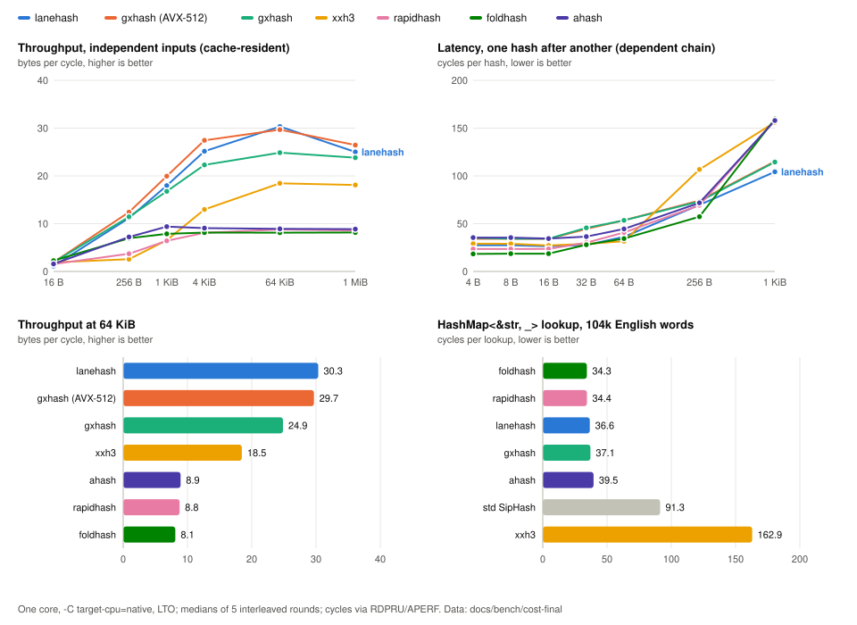

# lanehash – AES-lane hashing for Rust

A fast, non-cryptographic 64-bit and 128-bit hash for bulk data.



- **Fast:** 25–30 bytes/cycle on cache-resident 4 KiB+ inputs.
- **High quality:** passes all tested SMHasher and SMHasher3 tests.
- **Stable:** `hash64` and `hash128` produce identical output across backends.
- **Portable:** AES-NI, VAES, Armv8 AES, or a software fallback, selected automatically.
- **Streaming & batched:** supports `Stream` and `hash64_batch`.
- **`HashMap` / `HashSet`:** provides `RandomState` and `FixedState`.
- **`no_std`:** no dependencies.
- **Safe:** does not read past input boundaries.

> lanehash is **not cryptographic** and should not be used for passwords, signatures, or
> content addressing where adversarial collision resistance is required.

## Performance

For cache-resident inputs of 1 KiB and larger, lanehash is typically **1.5–3.5× faster**
than xxh3 and multiply-based hashes such as rapidhash, foldhash, and ahash on the
benchmark machine.

Short one-shot inputs are not the target workload and can be slower than those hashes.

See [`docs/bench/TABLES.md`](docs/bench/TABLES.md) for full results.

## Quality

| Test | Result |
|---|---:|
| SMHasher3 `--test=All` | 188 / 188 pass |
| SMHasher3 `--extra --test=All` | 252 / 252 pass |
| rurban SMHasher `--test=All` | 0 failures |
| Miri | clean |
| Guard-page test | no fault |

## Usage

```toml
[dependencies]
lanehash = "0.1"
```

### One-shot

```rust
let h64 = lanehash::hash64(b"hello world", 42);
let h128 = lanehash::hash128(b"hello world", 42);
```

### Streaming

```rust
let mut s = lanehash::Stream::new(42);
s.update(b"hello ");
s.update(b"world");

assert_eq!(s.finish128(), lanehash::hash128(b"hello world", 42));
```

### Batched

```rust
let records: Vec<&[u8]> = vec![&[1u8; 200], &[2u8; 300], b"short"];
let mut out = vec![0u64; records.len()];

lanehash::hash64_batch(&records, 42, &mut out);
```

### `HashMap` / `HashSet`

```rust
use std::collections::HashMap;

let mut map: HashMap<&str, u32, lanehash::RandomState> = HashMap::default();
map.insert("key", 1);

let fixed: HashMap<u64, u64, lanehash::FixedState> =
    HashMap::with_hasher(lanehash::FixedState::new(7));
```

`HashMap`/`HashSet` use a separate `std::hash::Hasher` implementation. Its output may
change between minor versions and should not be persisted.

## Backends

The fastest supported backend is selected automatically:

| Platform | Backend |
|---|---|
| x86-64 | VAES + AVX-512VL |
| x86-64 | VAES + AVX2 |
| x86-64 | AES-NI |
| aarch64 | Armv8 AES |
| Any | Portable software fallback |

All backends produce the same bits as the portable reference.

## Features

- `std` *(default)* — runtime CPU detection and `RandomState`.
- `force-fallback` — portable backend, useful for testing.

## Stability

`hash64`, `hash128`, `Stream`, and batch hashing are frozen for version `0.1`.

Verification values:

- 64-bit: `0x9FF60BEF`
- 128-bit: `0x1A79672D`

Minimum supported Rust version: **1.89**.

## License

MIT OR Apache-2.0
